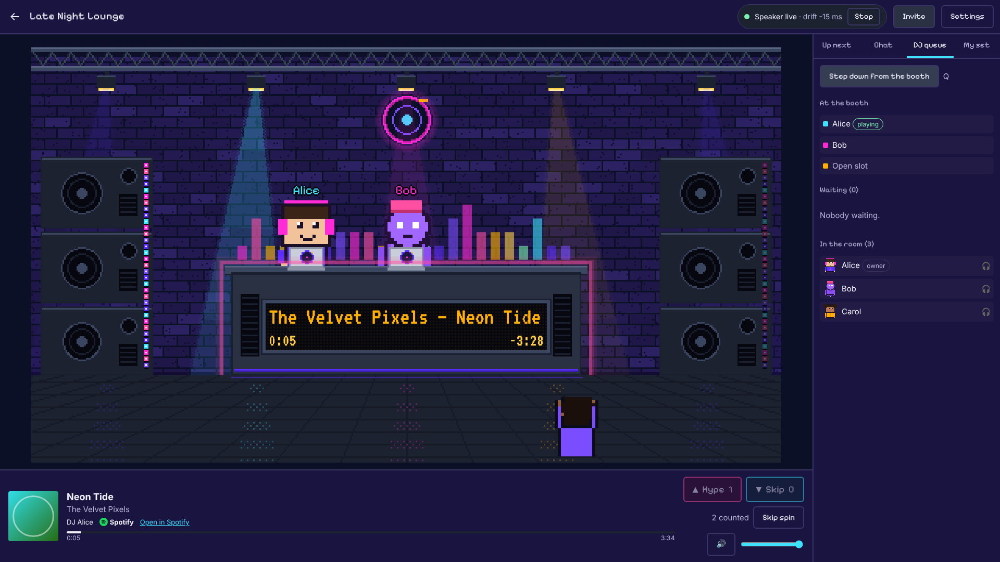
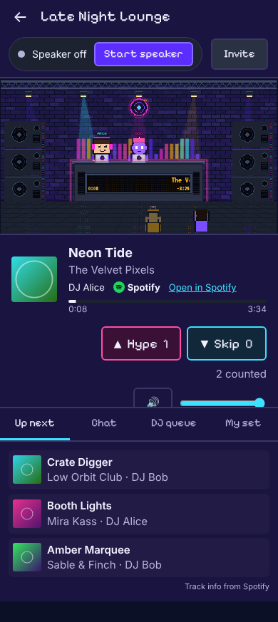
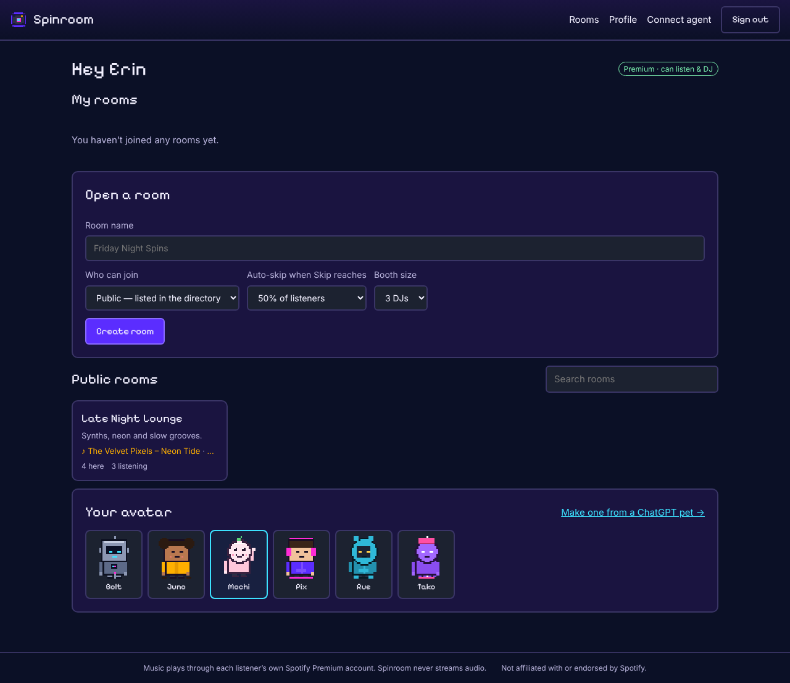

# Spinroom

Social DJ rooms on Spotify. Friends gather in a tiny pixel nightclub, take turns DJing from their Spotify playlists, and vote each track **Hype** or **Skip**. Spinroom never streams audio: every listener plays the same track at the same position on their own Spotify Premium account, in a browser **speaker** tab. Spinroom owns the room, the rotation, the votes and the sync.

The same room is reachable from three surfaces on one API:

- **Web app**: the visual room and the speaker.
- **MCP server**: join, vote, queue songs and chat from Claude, Codex, Cursor, Grok or any MCP client.
- **Slack app**: a live now-playing card with voting and queue controls.



<p align="center"> &nbsp; </p>

The product spec is [docs/PRD.md](docs/PRD.md), the build plan is [docs/BUILD_PLAN.md](docs/BUILD_PLAN.md), and the scene design system is [docs/design/pixel-neon-dj.md](docs/design/pixel-neon-dj.md).

---

## Architecture

```
            ┌──────────── one public origin (web + /v1) ─────────────┐
 browser ──▶│  apps/web (Vite/React SPA, speaker tab)                │
            │      │  /v1 REST + WebSocket /v1/rooms/{slug}/live      │
            │      ▼                                                  │
            │  apps/api (Fastify) ── room runtime ── packages/room-engine (pure rules)
            │      │        │                                         │
            │   Postgres   Redis (state, single-writer lock, pub/sub events)
            └──────────────────────────┬──────────────────────────────┘
                                       │ events:room:*  + token exchange
           apps/mcp (MCP over HTTP+OAuth / stdio) ┘└ apps/slack (Bolt, HTTP mode)
```

| Path                   | What it is                                                                                                                                                   |
| ---------------------- | ------------------------------------------------------------------------------------------------------------------------------------------------------------ |
| `packages/contracts`   | Zod schemas for every REST route, WebSocket event, error code and room setting. `openapi.json` is generated from them.                                       |
| `packages/room-engine` | Pure TypeScript rules: rotation, voting, auto-skip, bounce, presence, pause. It has no I/O and is fully unit-tested, including a 50-bot simulation.          |
| `packages/sdk`         | Typed REST client, live-room socket (seq-gap resync, 1–30 s backoff), server clock and drift controller. Used by web, MCP and Slack.                         |
| `packages/db`          | Drizzle schema, Postgres client and AES-GCM sealer shared by the API and Slack services.                                                                     |
| `apps/api`             | Auth (Spotify PKCE with your own Client ID), rooms, sets, votes, chat, moderation, speakers, avatars, the OAuth 2.1 server for MCP, and the realtime socket. |
| `apps/web`             | Lobby, room (stage, player panel, rail), speaker, avatar studio, settings, Integrations, OAuth consent.                                                      |
| `apps/mcp`             | `spinroom-mcp`: 17 tools, a now-playing resource with subscriptions, and the `spinroom_session` prompt.                                                      |
| `apps/slack`           | Install, account linking, `/spinroom` commands, live card, buttons, modal.                                                                                   |
| `apps/server`          | The API, MCP server and Slack app in one process on one port, for a single free instance (see Deploying).                                                    |
| `tools/art`            | All built-in pixel art, generated in code (`pnpm art`).                                                                                                      |

Key guarantees:

- **Server-authoritative sync.** Each spin has a `startedAtServerMs`. Speakers play at `now + offset − startedAtServerMs`, using the median of the last 5 clock samples. They check drift every 5 s, seek when it exceeds 500 ms, and reload after two checks over 3 s. The server owns track transitions: a timer fires at the end plus a 2 s grace, with a tick safety net behind it.
- **Single writer per room.** Commands run under a Redis lock. State lives in Redis and is rebuilt from Postgres on loss. Timers are rescheduled after restarts.
- **One API.** Every client uses the same `/v1` endpoints. A contract test fails if any registry route is missing, and responses are validated against their schemas outside production.

## Quick start (fake Spotify, no accounts needed)

Prerequisites: Node 22, pnpm 10, Postgres 16 and Redis 7 (`docker compose up -d` starts them, or use local installs).

```bash
pnpm install
cp .env.example .env                      # defaults run in SPOTIFY_MODE=fake
pnpm db:migrate && pnpm seed              # 3 fake users, 2 rooms
pnpm --filter @spinroom/api dev           # API on :8080
pnpm --filter @spinroom/web dev           # web on http://127.0.0.1:5173 (proxies /v1 to the API)
```

Open <http://127.0.0.1:5173>, click **Sign in with Spotify → Continue to test sign-in**, and pick `alice`. Open a second browser profile as `bob`. In the room, click **Start speaker**, add tracks under **My set**, and press **Q** to step up to the booth. Fake mode uses a fictional catalog and a silent simulated player, so sync, votes and rotation all work without audio.

Optional services:

```bash
pnpm --filter spinroom-mcp dev            # remote MCP on :8090/mcp
pnpm --filter @spinroom/slack dev         # Slack app on :8070
```

## Real Spotify (bring your own Client ID)

Spotify caps development-mode apps at 5 users, and extended quota requires 250,000 MAU. So Spinroom is built for **option B**: each user creates a free Spotify developer app and pastes its Client ID. Login is PKCE, so no client secret is ever stored.

1. Set `SPOTIFY_MODE=real` and `PUBLIC_ORIGIN` to your origin. Locally, use `http://127.0.0.1:5173`: Spotify requires loopback redirect URIs to use `127.0.0.1`, not `localhost`.
2. Each user opens **Connect Spotify**, which walks them through it:
   - create an app at <https://developer.spotify.com/dashboard>;
   - select **Web API** and **Web Playback SDK**;
   - add the redirect URI shown on screen (`<origin>/v1/auth/spotify/callback`);
   - paste the Client ID.
3. Up to 4 friends can sign in through someone else's app ("Join through a friend's app"). The app owner adds them under **User Management**, and they share the owner's quota.
4. Login failures are named on screen with their fix: redirect URI mismatch, user not on the allowlist, cancelled sign-in, or quota exceeded. Free accounts sign in as **remote only**: they can browse, chat and vote, but cannot run a speaker or DJ.
5. Option A (development only): set `SPOTIFY_DEV_CLIENT_ID` to use one shared app when a user has none.

The Spotify client targets the 2026 development-mode endpoints, falling back to the legacy paths if those fail:

- `POST /me/playlists`;
- `/playlists/{id}/items`;
- search capped at 10 results;
- `429 QUOTA_EXCEEDED` mapped to `quota_exceeded` for that user only.

If playlist writes are refused (403), that member's set falls back to a Spinroom-side list, and they are told why.

**Spotify branding:** the player panel shows Spotify's metadata and art unaltered, with attribution and **Open in Spotify** links. Replace the placeholder mark in `apps/web/src/room/PlayerPanel.tsx` (`SpotifyMark`) with the official logo from Spotify's brand kit before launch.

## Environment variables

Every variable is listed with comments in [`.env.example`](.env.example). The most important:

| Variable                                                                               | Purpose                                                                                |
| -------------------------------------------------------------------------------------- | -------------------------------------------------------------------------------------- |
| `PUBLIC_ORIGIN`                                                                        | Public origin of web + `/v1` (also the OAuth issuer and the Spotify redirect base).    |
| `DATABASE_URL`, `REDIS_URL`                                                            | Postgres 16 and Redis 7.                                                               |
| `SESSION_SECRET`                                                                       | HMAC key for session JWTs (required in production).                                    |
| `ENCRYPTION_KEY`                                                                       | 32-byte base64 key sealing Spotify and Slack tokens at rest (required in production).  |
| `SPOTIFY_MODE`                                                                         | `real` or `fake` (fake is refused in production unless `ALLOW_FAKE_SPOTIFY=1`).        |
| `DB_POOL_MAX`                                                                          | Postgres pool size (keep the total under the database's connection limit).             |
| `WEB_ORIGINS`                                                                          | Extra web origins allowed to open the live socket (`PUBLIC_ORIGIN` always is).         |
| `VITE_LIVE_ORIGIN` (web build)                                                         | Live socket origin when the web app is hosted apart from the API (`wss://api.host`).   |
| `SERVICE_SECRET_SLACK`, `SERVICE_SECRET_MCP`                                           | Credentials the Slack and MCP services use for token exchange.                         |
| `MCP_RESOURCE_URL`                                                                     | Public URL of the MCP endpoint (the audience of MCP tokens).                           |
| `STORAGE_DRIVER`, `S3_*`, `ASSET_BASE_URL`                                             | Avatar storage: filesystem in dev, any S3-compatible store behind a CDN in production. |
| `AVATAR_SAFETY`                                                                        | `manual` review queue (default) or `auto_approve` (development only).                  |
| `ADMIN_SPOTIFY_IDS`                                                                    | Spotify user IDs who can review avatars at `/admin`.                                   |
| `SLACK_SIGNING_SECRET`, `SLACK_CLIENT_ID`, `SLACK_CLIENT_SECRET`, `SLACK_STATE_SECRET` | Slack app credentials.                                                                 |

## MCP: use Spinroom from a coding agent

The browser tab is the speaker; the agent is the remote. Agents never see Spotify tokens. **Profile → Integrations** shows copy-ready snippets and a one-time link code.

**Remote server (OAuth 2.1, recommended).** Deploy `apps/mcp` at `https://mcp.<domain>/mcp`. Clients discover the authorization server through `/.well-known/oauth-protected-resource`, register dynamically, and sign in with Spotify in a browser window. Tokens are audience-bound and can be revoked from the Profile page.

| Client                         | Setup                                                                     |
| ------------------------------ | ------------------------------------------------------------------------- |
| Claude Code                    | `claude mcp add --transport http spinroom https://mcp.<domain>/mcp`       |
| Claude Desktop / claude.ai     | Settings → Connectors → Add custom connector → paste the URL              |
| Codex (`~/.codex/config.toml`) | `[mcp_servers.spinroom]` with `url = "https://mcp.<domain>/mcp"`          |
| Cursor (`.cursor/mcp.json`)    | `{ "mcpServers": { "spinroom": { "url": "https://mcp.<domain>/mcp" } } }` |

**Local stdio (personal token).** For clients without remote MCP or OAuth support, including Grok and older clients:

```bash
SPINROOM_URL=https://<domain> npx -y spinroom-mcp login ABCD-1234   # code from Profile → Integrations → Local server
```

```json
{ "mcpServers": { "spinroom": { "command": "npx", "args": ["-y", "spinroom-mcp"], "env": { "SPINROOM_URL": "https://<domain>" } } } }
```

Tools: `list_rooms`, `join_room`, `leave_room`, `now_playing`, `vote`, `search_tracks`, `crate_add`, `crate_list`, `crate_remove`, `crate_move`, `dj_queue_join`, `dj_queue_leave`, `skip_my_spin`, `create_room`, `invite`, `chat_send`, `room_history`.

- Resource: `spinroom://room/{slug}/now-playing` (subscribable).
- Prompt: `spinroom_session`.
- Every audio-related response includes `speaker_status`, plus a speaker link when no speaker is live.
- Agent writes are limited to 20 per minute per user.

## Slack app

1. Create the app from [`apps/slack/manifest.yml`](apps/slack/manifest.yml) after replacing `spinroom.example.com` with your origin. Then set the `SLACK_*` variables and run `apps/slack`.
2. Install it per workspace at `<origin>/v1/integrations/slack/install`.
3. In a channel, an owner or moderator runs `/spinroom link <room>`. A now-playing card appears and is edited in place, at most once every 3 s per channel. It is reposted after 50 newer messages.
4. Card buttons: **Hype**, **Skip**, **Join DJ queue**, **Open speaker**, **Add to my set**. The last opens a Spotify search modal.
5. Slash commands: `now`, `hype`, `skip`, `add <search>`, `dj`, `undj`, `invite @user`, `speaker`, `unlink`, `help`.
6. Each Slack user connects once with the **Connect Spinroom** button. It is a signed link that's valid for 15 minutes.

The manifest adds `channels:history` and `groups:history` to the PRD's scopes. Spinroom only uses them to count newer messages so it can repost the card. Before promoting a workplace "office radio", check Spotify's personal, non-commercial use terms.

## Testing

```bash
pnpm lint && pnpm typecheck
pnpm test        # unit + integration + contract tests (needs Postgres + Redis)
pnpm e2e         # Playwright journeys (starts its own API + web on :8081/:5174, fake Spotify)
pnpm size        # initial JS budget, after `pnpm --filter @spinroom/web build`
pnpm art         # rebuild the pixel art (fails if over the 400 KB budget)
```

Test databases: `spinroom_test`, `spinroom_test_mcp`, `spinroom_test_slack` and `spinroom_e2e`. `scripts/init-test-db.sql` creates the first one for Docker Compose; create the others the same way. CI ([`.github/workflows/ci.yml`](.github/workflows/ci.yml)) runs everything above on every push.

What the automated checks cover, mapped to the PRD's acceptance checks:

| Phase | Check                                                                                                       | Status                                 |
| ----- | ----------------------------------------------------------------------------------------------------------- | -------------------------------------- |
| 1     | Login and profile; Free accounts flagged remote-only; named setup failures                                  | Automated (API + Playwright)           |
| 2     | Every FR-D / FR-V rule, including ties, DJ leaving mid-spin, empty booth and cooldowns; 50 bots × 100 spins | Automated (34 engine tests)            |
| 3     | Late joiner starts at the live position; background tab keeps the speaker live; drift logic                 | Automated (fake player)                |
| 4     | Journeys 1 and 2; bundle budget (117.6 KB of 300 KB); reduced motion; avatar import plus each invalid case  | Automated                              |
| 5     | All tools; OAuth discovery, registration, PKCE, refresh and revocation; stdio login                         | Automated (in-memory and HTTP clients) |
| 6     | Card posting and updates; Slack vote reaches the web in < 1 s; ≤ 1 edit per 3 s under 20 votes in 10 s      | Automated (fake Slack API)             |

These still need real accounts or people:

- Spotify Client ID setup timed under 5 minutes.
- Two Premium accounts on two machines within 500 ms drift for 10 tracks.
- A real ChatGPT sprite kit import (confirm the format against a fresh export).
- Journey 3 in two real MCP clients.
- Journey 4 in a real Slack workspace.
- A staging deploy.
- Spotify policy review and a trademark search for the name.

## Deploying

Each service deploys separately (`Dockerfile` targets `api`, `mcp`, `slack`, `web`); the default target `server` holds the Node services and picks one by command, including `node server/dist/main.js`, which runs all three in one process. The layouts below all work.

### Single origin (any container host)

Route one public origin as follows; `deploy/nginx.conf` is an example:

| Path                                                                                     | Service   |
| ---------------------------------------------------------------------------------------- | --------- |
| `/v1/*` (including the WebSocket `/v1/rooms/{slug}/live`)                                | api       |
| `/oauth/(authorize\|token\|register\|revoke)`, `/.well-known/oauth-authorization-server` | api       |
| `/v1/integrations/slack/*`                                                               | slack     |
| everything else                                                                          | web (SPA) |
| `mcp.<domain>/mcp`, `mcp.<domain>/.well-known/oauth-protected-resource`                  | mcp       |

### Free tier: Vercel + Render + Supabase

Everything runs on free plans. The static web app is on Vercel; **one** free Render web service runs the API, the remote MCP server and the Slack app in one process ([`apps/server`](apps/server)), with a free Render Key Value for Redis; Postgres and avatar storage are on Supabase's free plan. Vercel rewrites `/v1/*` (Slack included) and the OAuth paths to Render ([`apps/web/vercel.json`](apps/web/vercel.json)), so REST calls, cookies, CSRF and the Spotify callback stay on the web origin. Rewrites can't carry WebSocket upgrades, so the room's live socket connects straight to Render (`VITE_LIVE_ORIGIN`) with a one-time ticket from `POST /v1/rooms/{slug}/live-ticket` in place of the cookie.

1. **Supabase.** Create a free project. Copy the **Session pooler** connection string (Connect → Session pooler; it works over IPv4) and append `?sslmode=require`. In Storage, create a private bucket `avatars`, enable the S3 connection (Storage → Settings) and create an access key; note the endpoint (`https://<ref>.storage.supabase.co/storage/v1/s3`) and region. Then, in the SQL editor, close Supabase's auto-generated REST API over Spinroom's tables (the server connects to Postgres directly as their owner and never uses it; by default every new table in `public` is readable and writable with the public anon key):

   ```sql
   alter default privileges for role postgres in schema public revoke all on tables from anon, authenticated;
   alter default privileges for role postgres in schema public revoke all on sequences from anon, authenticated;
   alter default privileges for role postgres in schema public revoke all on functions from anon, authenticated;
   revoke usage on schema public from anon, authenticated;
   ```

2. **Render.** New → Blueprint → this repository ([`render.yaml`](render.yaml)). Enter `PUBLIC_ORIGIN` (the Vercel URL you'll use, e.g. `https://spinroom-web.vercel.app`), `DATABASE_URL`, the `S3_*` values, and (later) the Slack app credentials. It starts in fake Spotify mode for a smoke test; migrations run on boot. For deploy-on-push, install Render's GitHub app (github.com/apps/render → Configure) on the account or organization that owns the repository and give it access to this repo; without it Render can still build the repo, but only when a deploy is started by hand.
3. **Vercel.** New project from this repository, root directory `apps/web` (framework and commands come from `vercel.json`). Set `VITE_LIVE_ORIGIN=wss://spinroom.onrender.com`. If Render gave the service another hostname, update the rewrites in `apps/web/vercel.json` and `MCP_RESOURCE_URL` in `render.yaml`.
4. **Keep it awake.** Add a free uptime monitor (UptimeRobot, cron-job.org…) for `https://spinroom.onrender.com/healthz?deep=1` every 5–10 minutes. It keeps the Render instance from sleeping (one always-on instance fits the 750 free hours a month) and gives Supabase the daily database activity that stops a free project from pausing.
5. **Smoke test** at the Vercel URL: fake sign-in, create a room, join from a second browser, vote; the live socket should update within a second. `GET /.well-known/oauth-authorization-server` should report the Vercel URL as issuer. Upload a custom avatar.
6. **Go live.** In your Spotify app, add `<PUBLIC_ORIGIN>/v1/auth/spotify/callback` as a redirect URI; then on Render set `SPOTIFY_MODE=real` and delete `ALLOW_FAKE_SPOTIFY`. Point the Slack app's request URLs at `<PUBLIC_ORIGIN>/v1/integrations/slack/{events,interactivity,commands,options}` and add `https://spinroom.onrender.com/mcp` to your MCP clients.

**Limits of the free layout.** It suits a group of friends (a few rooms, dozens of listeners), not a public launch:

- Without the uptime monitor, the service sleeps after 15 idle minutes; the next visitor waits about a minute and Slack commands sent while it wakes time out.
- 512 MB RAM and a shared CPU on Render (the server idles around 160 MB; avatar processing is slower).
- Supabase free: 500 MB of database and about 1 GB of avatar storage; a project paused for inactivity has to be restored from its dashboard.
- Free Key Value doesn't persist; after a restart the API rebuilds room state from Postgres.
- Vercel's Hobby plan is for non-commercial use.

Preview deployments get their own `*.vercel.app` URL; add each one you want to use to `WEB_ORIGINS` (pages on other origins can't open the live socket).

### Scaling up on Render

[`deploy/render-scaled.yaml`](deploy/render-scaled.yaml) runs the API, MCP and Slack as separate paid, always-on services with Render Postgres and Key Value (New → Blueprint, file path `deploy/render-scaled.yaml`). Point the Vercel rewrites at `spinroom-api` (and `/v1/integrations/slack/*` at `spinroom-slack`, listed before `/v1/*`), set `VITE_LIVE_ORIGIN=wss://spinroom-api.onrender.com`, and use `https://spinroom-mcp.onrender.com/mcp` for MCP clients.

### Notes

- The API runs migrations on boot (`MIGRATE_ON_BOOT=0` disables this).
- Any API instance can serve any room: the Redis lock keeps one writer per room, and a 5 s ticker on each instance claims rooms through Redis.
- Use sticky sessions only if your platform needs them for WebSockets.
- Avatars go to S3-compatible storage behind a CDN, with immutable caching keyed by content hash.
